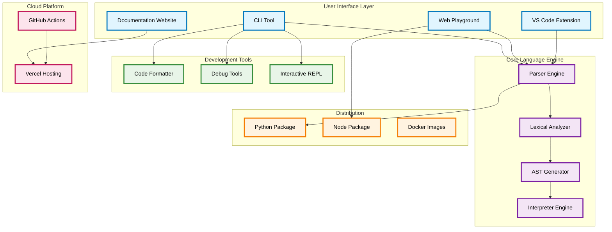
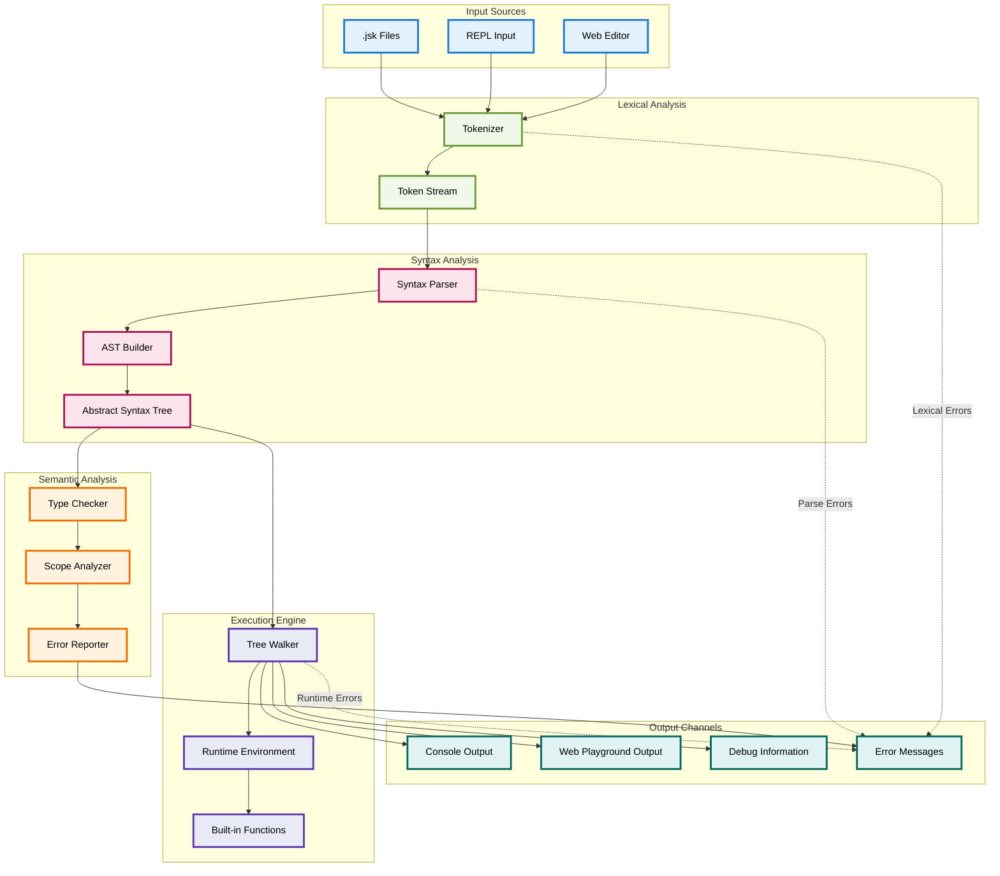
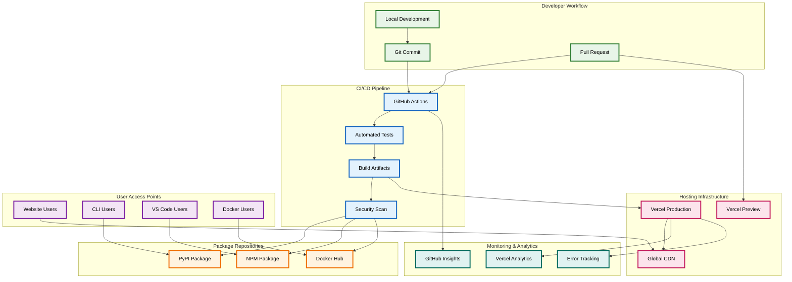
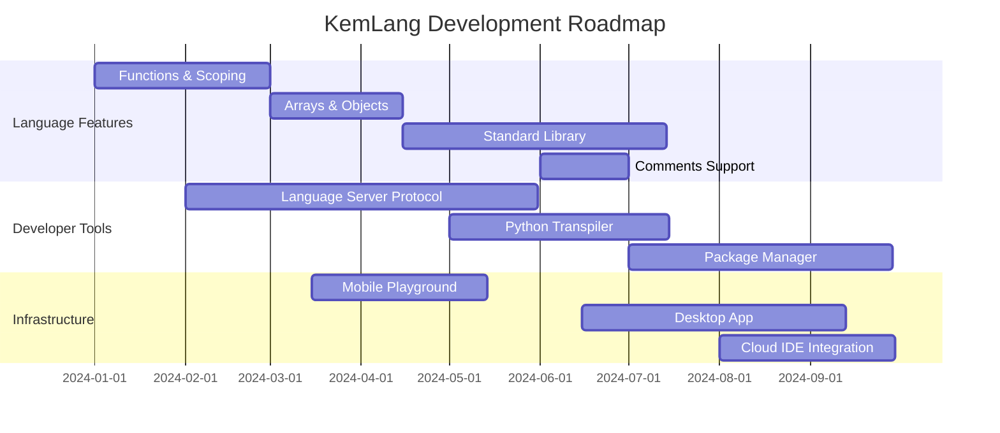

# KemLang

**A Gujarati-flavored, English-typed programming language**

KemLang is a fun, educational programming language inspired by Bhailang, featuring Gujarati keywords and expressions while maintaining English-based syntax. It's designed to be approachable for Gujarati speakers learning programming concepts.

[](https://github.com/sanketmuchhala/Gujju.py/actions/workflows/ci.yml)
[](https://www.python.org/downloads/)
[](LICENSE)
[](https://kemlang.dev)

---

## Table of Contents

- [System Architecture](#system-architecture)
- [Data Flow](#data-flow)
- [Deployment Architecture](#deployment-architecture)
- [Features](#features)
- [Quick Start](#quick-start)
- [Language Reference](#language-reference)
- [CLI Usage](#cli-usage)
- [Examples](#examples)
- [Development](#development)

---

## System Architecture

KemLang follows a modular architecture with clear separation of concerns across different layers:



### Component Overview

| Component | Purpose | Technology |
|-----------|---------|------------|
| **Lexical Analyzer** | Tokenizes KemLang source code | Python |
| **Parser Engine** | Generates Abstract Syntax Trees | Recursive Descent Parser |
| **Interpreter** | Executes parsed KemLang programs | Tree-walking Interpreter |
| **CLI Tool** | Command-line interface | Python + Typer |
| **Web Playground** | Browser-based code editor | Next.js + TypeScript |
| **VS Code Extension** | Syntax highlighting & IntelliSense | TypeScript |

---

## Data Flow

The following diagram illustrates how KemLang code flows through the system from source to execution:



### Processing Pipeline

1. **Source Input**: KemLang code from files, REPL, or web editor
2. **Tokenization**: Breaking source code into meaningful tokens
3. **Parsing**: Building an Abstract Syntax Tree (AST)
4. **Analysis**: Type checking and scope validation
5. **Execution**: Tree-walking interpretation with runtime environment
6. **Output**: Results, errors, or debug information

---

## Deployment Architecture

KemLang uses a modern cloud-native deployment strategy across multiple platforms:



### Deployment Environments

| Environment | Platform | Purpose | URL |
|-------------|----------|---------|-----|
| **Production** | Vercel | Main website & playground | https://kemlang.dev |
| **Preview** | Vercel | PR previews | Auto-generated URLs |
| **CLI Package** | PyPI | Python package distribution | `pip install kemlang` |
| **Web Assets** | NPM | JavaScript/TypeScript modules | `npm install kemlang` |

---

## Features

- **Gujarati-flavored keywords**: `kem bhai`, `bhai bol`, `bapu tame bolo`
- **English-typed syntax**: Easy to type on any keyboard
- **Simple grammar**: Variables, conditionals, loops, and expressions
- **Rich error messages**: Line/column tracking with diagnostic snippets
- **CLI tools**: Run, format, debug, and analyze KemLang code
- **VS Code support**: Syntax highlighting extension included
- **Web playground**: Interactive browser-based code editor
- **Comprehensive docs**: Full documentation at [https://gujju-py.vercel.app/]([https://kemlang.dev](https://gujju-py.vercel.app/docs))

---

## Quick Start

### Installation

#### **NPM (Recommended - Like Bhailang)**
```bash
npm install -g kemlang
```

#### **One-liner Install Script**
```bash
curl -fsSL https://raw.githubusercontent.com/sanketmuchhala/Gujju.py/main/install.sh | bash
```

#### **Python/Pip (Direct)**
```bash
# From PyPI (when available)
pip install kemlang

# From source
git clone https://github.com/sanketmuchhala/Gujju.py
cd kemlang
pip install -e .
```

#### **Developer Setup**
```bash
git clone https://github.com/sanketmuchhala/Gujju.py
cd kemlang
pip install -e ".[dev,test]"
```

### Hello World

Create a file `hello.jsk`:

```kemlang
kem bhai
aa naam che bapu tame bolo
bhai bol "kem cho, " + naam + "!"
aavjo bhai
```

Run it:

```bash
kem run hello.jsk
# Input: Sanket
# Output: kem cho, Sanket!
```

---

## Language Reference

### Program Structure

Every KemLang program must be enclosed in `kem bhai` ... `aavjo bhai`:

```kemlang
kem bhai
  // Your code here
aavjo bhai
```

### Statements

| Statement | Syntax | Description |
|-----------|---------|-------------|
| **Print** | `bhai bol <expr>` | Print expression to stdout |
| **Declare** | `aa <id> che <expr>` | Declare new variable |
| **Assign** | `<id> che <expr>` | Assign to existing variable |
| **If** | `jo <expr> { ... }` | Conditional execution |
| **If-Else** | `jo <expr> { ... } nahi to { ... }` | Conditional with alternative |
| **While** | `farvu { ... } jya sudhi <expr>` | Loop while condition is truthy |
| **Break** | `tame jao` | Exit current loop |
| **Continue** | `aagal vado` | Skip to next loop iteration |

### Expressions

| Type | Syntax | Example |
|------|---------|---------|
| **Integers** | `42`, `0`, `-5` | Numbers |
| **Strings** | `"hello"`, `"kem cho"` | Text with escapes (`\n`, `\t`, `\"`, `\\`) |
| **Booleans** | `bhai chhe`, `bhai nathi` | true, false |
| **Input** | `bapu tame bolo` | Read line from stdin |
| **Variables** | `naam`, `count` | Identifier references |

### Operators

| Category | Operators | Precedence |
|----------|-----------|------------|
| **Arithmetic** | `+`, `-`, `*`, `/`, `%` | `* / %` > `+ -` |
| **Comparison** | `==`, `!=`, `<`, `>`, `<=`, `>=` | Lower than arithmetic |
| **Unary** | `-` (negation) | Highest |

**Note**: String concatenation uses `+` operator (string + string only).

### Language Grammar (EBNF)

```ebnf
program      := start_fence stmt* end_fence
start_fence  := "kem bhai"
end_fence    := "aavjo bhai"
stmt         := print | decl | assign | if | while | break | continue
print        := "bhai bol" expr
decl         := "aa" IDENT "che" expr
assign       := IDENT "che" expr
if           := "jo" expr block ("nahi to" block)?
while        := "farvu" block "jya sudhi" expr
break        := "tame jao"
continue     := "aagal vado"
block        := "{" stmt* "}"
expr         := equality
equality     := comparison (("=="|"!=") comparison)*
comparison   := term ((">"|"<"|">="|"<=") term)*
term         := factor (("+"|"-") factor)*
factor       := unary (("*"|"/"|"%") unary)*
unary        := ("-") unary | primary
primary      := INT | STRING | BOOL | IDENT | "(" expr ")" | "bapu tame bolo"
BOOL         := "bhai chhe" | "bhai nathi"
```

---

## CLI Usage

```bash
# Run a KemLang file
kem run file.jsk

# Run with tracing (show tokens and AST)
kem run file.jsk --trace

# Interactive REPL
kem repl

# Format code
kem fmt file.jsk
kem fmt --check .  # Check if files need formatting

# Show tokens
kem tokens file.jsk

# Show AST
kem ast file.jsk

# Version info
kem version
```

---

## Examples

### Variables and Arithmetic

```kemlang
kem bhai
aa x che 10
aa y che 5

bhai bol "Sum: " + (x + y)
bhai bol "Product: " + (x * y)
bhai bol "x > y: " + (x > y)
aavjo bhai
```

### Conditionals

```kemlang
kem bhai
aa age che 25

jo age >= 18 {
    bhai bol "You can vote!"
} nahi to {
    bhai bol "Too young to vote"
}
aavjo bhai
```

### Loops

```kemlang
kem bhai
aa i che 1
farvu {
    bhai bol "Count: " + i
    i che i + 1
    jo i > 5 { tame jao }
} jya sudhi bhai chhe
aavjo bhai
```

### Input and Interaction

```kemlang
kem bhai
bhai bol "What's your name?"
aa naam che bapu tame bolo

jo naam == "Sanket" {
    bhai bol "Hello, creator!"
} nahi to {
    bhai bol "Nice to meet you, " + naam + "!"
}
aavjo bhai
```

---

## Error Messages

KemLang provides helpful error messages with source context:

```
Error: Undefined variable 'typo'
--> line 3:9
3 | bhai bol typo
  |          ^^^^

Runtime Error: TypeError: cannot + int and str
--> line 2:15
2 | bhai bol 5 + "hello"
  |               ^^^^^^^
```

---

## Development

### Setup

```bash
git clone https://github.com/sanketmuchhala/Gujju.py
cd kemlang
pip install -e ".[dev,test]"
pre-commit install
```

### Testing

```bash
# Run all tests
pytest

# With coverage
pytest --cov=kemlang

# Property-based fuzz testing
pytest tests/test_prop_fuzz.py

# Lint and type check
ruff check kemlang tests
mypy kemlang
```

### VS Code Extension

1. Navigate to `editor/kemlang-vscode/`
2. Run `npm install && npm run compile`
3. Press F5 to launch Extension Development Host
4. Open a `.jsk` file to see syntax highlighting

### Web Playground

The web playground is available at [kemlang.dev/playground](https://kemlang.dev/playground) and built with Next.js.

For local development:
```bash
cd kemlang-website
npm install
npm run dev
# Open http://localhost:3000
```

---

## Roadmap

### Upcoming Features



### Feature Checklist

- [ ] **Functions**: `function naam(args) { ... }`
- [ ] **Arrays**: `[1, 2, 3]` and `obj[index]`
- [ ] **Objects/Maps**: `{key: value}` syntax
- [ ] **Standard Library**: Math, string, file operations
- [ ] **Comments**: `// single line` and `/* block */`
- [ ] **Imports**: Module system
- [ ] **Python Transpiler**: Compile KemLang to Python
- [ ] **Package Manager**: Dependency management
- [ ] **Language Server**: IDE integration with LSP
- [ ] **Mobile App**: React Native playground
- [ ] **Desktop App**: Electron-based IDE

---

## Contributing

We welcome contributions! Please see [CONTRIBUTING.md](CONTRIBUTING.md) for guidelines.

### Quick Contribution Guide

1. Fork the repository
2. Create a feature branch: `git checkout -b feature/amazing-feature`
3. Make your changes and add tests
4. Run the test suite: `pytest`
5. Commit changes: `git commit -m "Add amazing feature"`
6. Push to branch: `git push origin feature/amazing-feature`
7. Open a Pull Request

### Code of Conduct

This project follows our [Code of Conduct](CODE_OF_CONDUCT.md). Please be respectful and inclusive.

---

## License

This project is licensed under the MIT License - see the [LICENSE](LICENSE) file for details.

---

## Acknowledgments

- Inspired by [Bhailang](https://github.com/DulLabs/bhai-lang)
- Built with Python, Typer, and Rich
- Website powered by Next.js and Vercel
- Special thanks to the Gujarati programming community

---

## Support

- **Issues**: [GitHub Issues](https://github.com/sanketmuchhala/Gujju.py/issues)
- **Discussions**: [GitHub Discussions](https://github.com/sanketmuchhala/Gujju.py/discussions)
- **Email**: [Support](mailto:support@kemlang.dev)
- **Website**: [kemlang.dev](https://kemlang.dev)

---

<div align="center">

**Made with love for the Gujarati developer community**

[Website](https://kemlang.dev) • [Docs](https://kemlang.dev/docs) • [Playground](https://kemlang.dev/playground) • [Blog](https://kemlang.dev/changelog)

</div>
